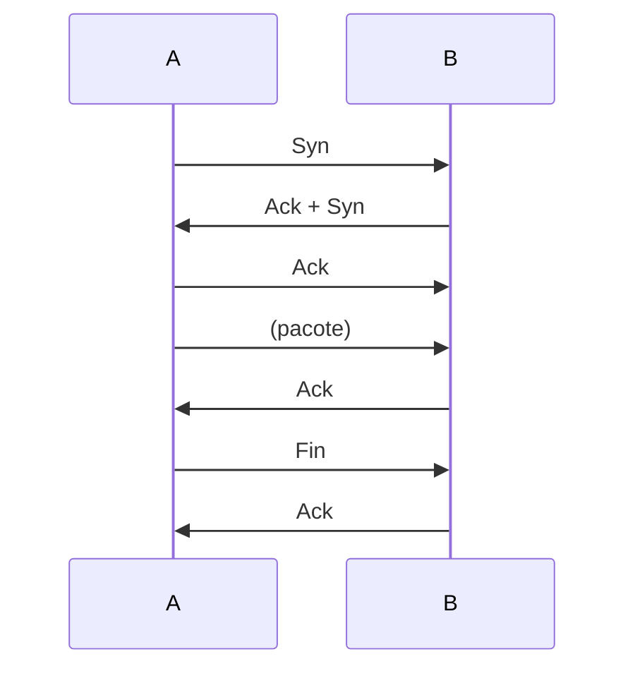

# TCP
- Orientado à stream
  - Fluxo: tem começo, meio e fim
  - O fluxo é segmentado (em pacotes), enviados de forma que possa ser reordenada
- **Conexão de circuito virtual**
  - Orientado à conexão - Simula um circuito - Sempre checa se a conexão ainda existe e fecha ela no final
    - *Overhead*
  - Para amenizar o overhead, tem um buffer que precisa ser preenchido antes que as informações possam ser enviadas
    - Evitando que dados menores que o próprio cabeçalho sejam enviados, criando overhead desnecessário
  - Tem a capacidade de ser full-duplex
    - *Apenas se o hardware permitir*
    - Isso duplica o buffer
- As portas em um pacote TCP determinam a aplicação que deve ser acessada
- *Source Port*:
  - Aplica uma porta ALTA e ALEATÓRIA
  - A aplicação (browser, por exemplo) pede pro OS uma porta
- *Dest Port*:
  - Uma porta (geralmente) BAIXA e (sempre) CONHECIDA
    - Se não for conhecida, o cliente não consegue acessar
  - HTTP padrão: 80, HHTPS padrão: 443
- *Sequence Number*:
  - Determina a sequência dos pacotes
- *Acknowledgement Number*:
  - Confirmar que uma informação foi recebida
  - Ativo quando o bit Ack for 1
- **Flags**
  - **Three Way Handshake**
  - *Syn*:
    - Pede para abrir uma conexão, carrega a seq
  - *Ack*:
    - Confirma o Syn
  - *Ack*:
    - Confirma do outro lado, já que é full-duplex
  - Fin: 
    - Sinaliza que um lado vai parar de enviar dados
  - Rst:
    - Reinicia a conexão
    - Reset, não funciona direito
    - Na prática abandona a transmissão e abre uma nova
    - Muito usado por hacker
  - Psh:
    - Envia as informações mesmo sem o buffer estar cheio
  - Urg:
    - Usado para tirar a informação do fluxo de processamento
    - Usado quando quer ler o Urgent Pointer
      - Lê o urgent pointer antes dos que estão antes dele no fluxo

- Se der 50ms e A não receber um Ack, ele manda o pacote novamente
- *Window Size*:
  - Determina o tamanho da janela de processamento
    - O quanto pode receber
- *Checksum*:
  - Source Port até TCP Header Length
- Estados:
  - *Listen*
  - *Estabilished* => Conexão estabelecida
  - UDP não tem estados