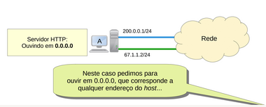

# Endereçamento IP -> Parte 3 - Classless
- **Classe da Máscara**
- *.0.0.0 -> _classe A_
- *.*.0.0 -> _classe B_
- *.*.*.0 -> _classe C
  
- 192.10.3.2
- 254.0.0.0
- 192.0.0.0         : _1100000|0_
- 193.255.255.255   : _1100000|1_

- ##Classless, CIDR, IPs reservados
- **CIDR**: o número de bits 1 em uma máscara
- Ele é notado como /_CIDR_ depois de um IP
  - 0.0.0.0/8
- Calcular máscara para $n$ número de máquinas:
  - $CIDR = 32-x$ bits 1, onde: $2^x-2 = n$
  - Ex: Qual é máscara para 2 máquinas em uma rede?
  - $2^x-2 = 2$
  - $2^x-2 = 2$
  - $2^x = 4 = 2^2$
  - $x = 2$
  - A máscara precisa de $32 - 2 = 30$ bits 1 para ter apenas 2 máquinas na rede:
  - _255.255.255.253 = 11111111.11111111.11111111.11111100_
- O objetivo é pegar o número de IPs dispónivel mais próximo possível do desejado para evitar desperdício
- **IPs reservados**
- Todo IP que começa com 0 é reservado
- Qualquer (thishost): 0.0.0.0/8
  - Serve para "juntar" duas placas de rede em uma mesma máquina -> se chega algo em uma, a outra também recebe
  - 
- Loopback/Localhost: 127.0.0.0/8
  - 127.0.0.1 própria máquina, **funciona em qualquer lugar**
- Não reteáveis na internet (IPs privados):
  - 10.0.0.0/8 -> 10.0.0.0 até 10.255.255.255 não são roteáveis
  - 172.16.0.0/12 -> 172.16.0.0 até 172.32.255.255 não são roteáveis
  - 192.168.0.0/16
  - 169.254.0.0/16 (auto configuração)
    - Esse é o IP que a máquina se auto dá caso não tenha uma rede configurada
    - *esse IP não funcion, só serve pra ver que não tá na rede*
  - Se algum desses IPs chega em um roteador, o pacote é descartado 
- Multicast: 224.0.0.0/4
  - Classe E
- Limited-Broadcast: 255.255.255.255/32
  - Broadcast para a internet inteira: _bloqueado por ser potencialmente perigoso_
- Não dá pra só colocar um IP qualquer em um máquina
  - Muito provavelmente a resposta nunca vai voltar pra você
- Existem distribuidoras de IP
- **NAT**: _Network Address Translator_
  - Altera o pacote de uma maneira que permite pegue o endereço de origem do pacote e o  troque para outro endereço de origem
  - **A internet só funciona até hoje por causa disso**
    - Ameniza a falta de IPs na internet
    - Permite ocultar redes
  - A nível de pacote cria muitos problemas
  - Fica no próprio roteador
    - se algum IP sai para a internet, sofre o SNAT (source NAT)
    - Coloca outro IP que pode ser trafegável na internet
    - quando o retorno chega, troca o IP que colocou pelo original
    - _10.0.0.1 -> 8.8.8.8_
    - _NAT troca para: 200.0.0.1 -> 8.8.8.8_
    - _8.8.8.8 -> 200.0.0.1_
    - _Quando chega: 8.8.8.8 -> 10.0.0.1_
  - Um pacote é enviado com: 
    
    - 200.0.0.1 (IP de origem) | 8.8.8.8 (Dst addr) | TCP (protocolo) | 50000 (porta da origem) | 80 (porta do destino) 
    - 200.0.0.1:50000:8.8.8.8:80:TCP

não relacionado mas muito foda: https://www.youtube.com/watch?v=HPqGaIMVuLs

