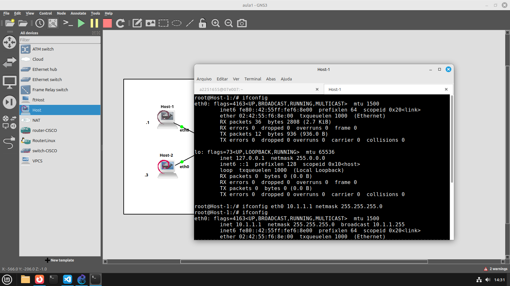
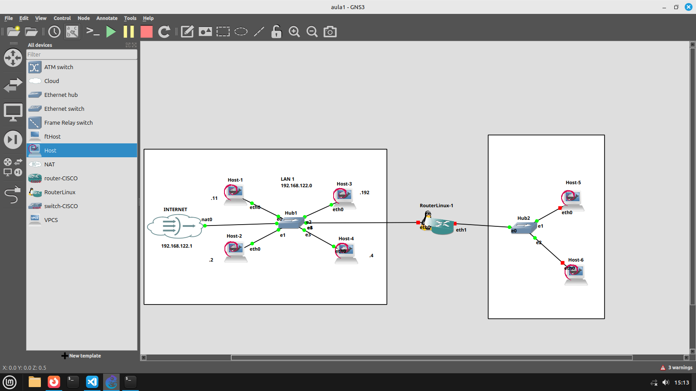
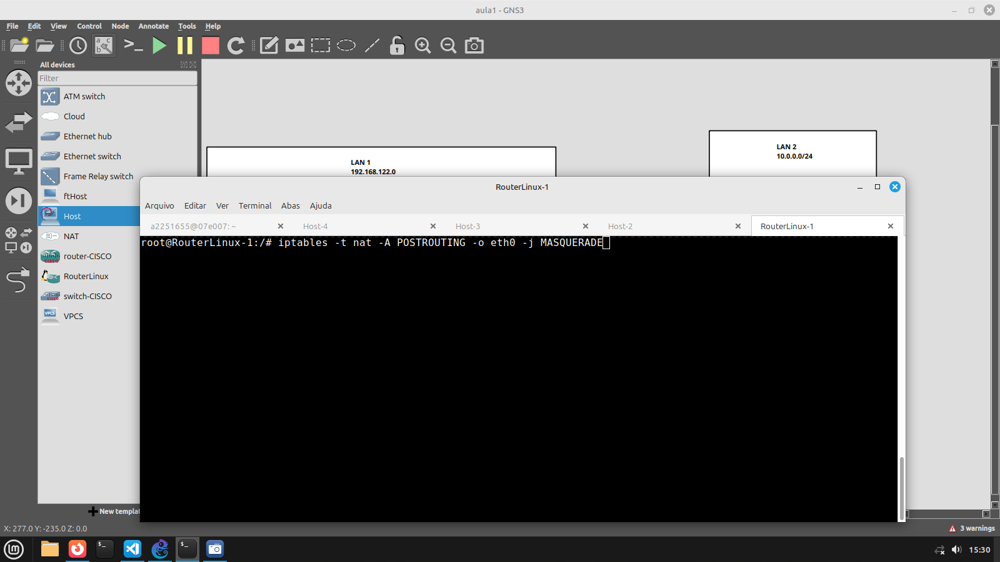

### ifconfig
- Vê as configurações de rede da máquina
- 
- ifconfig + *placa de rede* + ip + máscara seta um IP pra máscara
- Se não colocar uma máscara com o netmask (ou / depois do IP), ele vai pegar a classe classfull do IP
### route -n (números)
- Rotas do IP
  - #### add
    - Adiciona uma rota
    - **default gw (IP)**: adiciona uma rota padrão
### ip
- substitui os dois anteriores
  - #### address
    - configurações da rede, como o ifconfig
      - **add (ip/mascara) dev (placa)**: add 10.1.1.1/24 dev eth0 (não substitui caso já tenha)
      - **del (ip/mascara) dev (placa)**: deleta o ip
  - #### route
    - mesma coisa do route
    - **add default via 192.168.122.1**: adiciona rota padrão

### echo
- Escrever os nomes dos ips
  - #### "nameserver 8.8.8.8" > /etc/resolv.conf
    - pode acessar o IP pelo nome
### cat
  - Lê arquivos
### dhcpcd
  - configuração automática
  - não aparece no ifconfig
    - só pelo *ip*
  

- Roteadopr obrigatoriamente divide em duas redes
- 

- fazer com que o pacote de resposta volte da internet e volte pro lugar correto

- 1: roteador
- 0: não é roteador