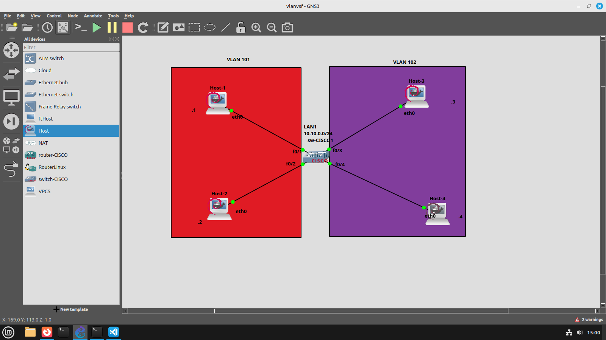

```bash
sw-CISCO1#vlan database
sw-CISCO1(vlan)#vlan 101 // cria a vlan no número escolhido
VLAN 101 added:
    Name: VLAN0101
sw-CISCO1(vlan)#vlan 102
VLAN 102 added:
    Name: VLAN0102

sw-CISCO1(vlan)#exit
sw-CISCO1#
```
##  SWITCH NÃO TEM IP
- Não precisa configurar como um roteador

### colocar a VLAN na porta
```bash
sw-CISCO1#configure terminal
sw-CISCO1(config)#interface f0/1
sw-CISCO1(config-if)#switchport access vlan 101 // associa a vlan 101 à porta f0/1
sw-CISCO1(config-f)#interface f0/2
sw-CISCO1(config-if)#switchport access vlan 101
sw-CISCO1(config-if)#interface f0/3
sw-CISCO1(config-if)#switchport access vlan 102 // associa a vlan 101 à porta f0/1
sw-CISCO1(config-f)#interface f0/4
sw-CISCO1(config-if)#switchport access vlan 102
```


```bash
sw-CISCO2(config)#interface f0/15
sw-CISCO2(config-if)#switchport mode trunk // determina a passagem de vlans
sw-CISCO2(config-if)#
*Mar  1 00:06:10.347: %DTP-5-TRUNKPORTON: Port Fa0/15 has become dot1q trunk
*Mar  1 00:06:10.351: %LINEPROTO-5-UPDOWN: Line protocol on Interface Vlan1, changed state to down
sw-CISCO2(config-if)#switchport trunk allowed vlan 101,102,1-2,1002-1005 // diz para a porta quais VLANs passam por alí
                                                    //     ^- 1-2 e 1002-1005 são padrões do CISCO
```

### configurar um roteador para passar as vlans
```bash
sw-CISCO2(config)#interface f0/0.101 // pega a vlan da interface
R-CISCO1(config-subif)#encapsulation dot1Q 101 
R-CISCO1(config-subif)#ip address 10.1.0.254 255.255.255.0 // configura o IP para cada vlan
R-CISCO1(config-subif)#interface f0/0.102
R-CISCO1(config-subif)#encapsulation dot1Q 102            
R-CISCO1(config-subif)#ip address 10.2.0.254 255.255.255.0
R-CISCO1(config-subif)#interface f0/0 // vai para a interface real
R-CISCO1(config-if)#no shutdown

```